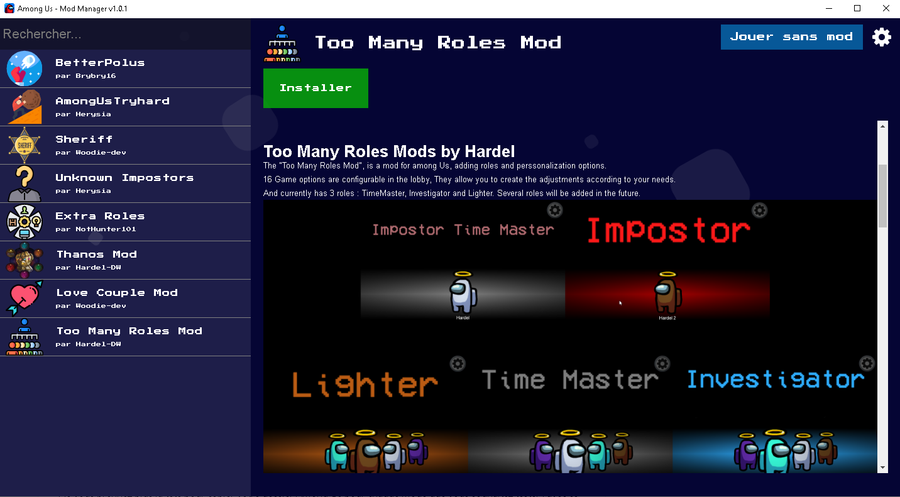
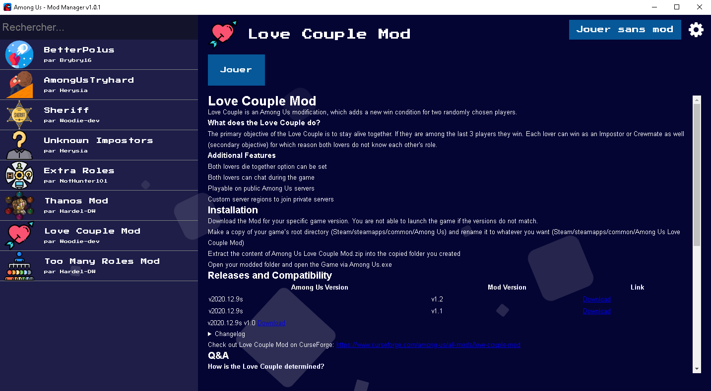

# Ce projet n'est plus maintenu est laisse place à un gestionnaire de mods plus générique : [Among Us - Mods](https://github.com/clicpanel/among-us-mods)
#________________________________________________________________________
# Among Us Mod Manager v1.0.1
## Gestionnaire de mod pour Among Us
Ne vous prennez plus la tête pour copier votre dossier Among Us pour chaque mode que vous souhaitez tester : avec ce gestionnaire de mod vous pourrez conserver votre unique version d'Among Us et le programme se chargera du reste.

#### [Télécharger Among Us Mod Manager v1.0.1 pour Windows](https://github.com/clicpanel/among-us-mod-manager/releases/download/v1.0.1/Among.Us.Mod.Manager.Installer.exe)

> Ce programme utilise les liens symboliques pour activer/désactiver les mods sur Among Us. Sous Windows l'utilisation des liens symboliques nécéssite l'ouverture de l'application avec les droits administrateurs.

### Fonctionnalités
- Téléchargement des mods depuis leur dernière version Github.
- Utilisation des liens symboliques pour ne pas avoir à créer plusieurs instances du jeu.
- Profitez de l'interface simple et intuitive.
- Téléchargez directement la dernières version des mods que vous souhaitez utiliser.
- Activez ou désactivez les mods sur votre jeu pour revenir à la version vanilla en un clique.
- Switchez parmi les mods que vous avez installé simplement en cliquant sur le bouton "Jouer".
- Très peu de configuration requise.
  
  
### Utilisation
Lors de votre première utilisation, veillez à cliquer sur l'engrennage (tout en haut à droite), puis cliquez sur la petite icône de dossier pour séléctionner votre exécutable Among Us (Amons Us.exe). Enfin, cliquez sur Enregistrer.
Et voilà vous êtes désormais prêt à utiliser le gestionnaire de mod !
### Un problème ?
N'hésitez pas à ouvrir une issue : https://github.com/clicpanel/among-us-mod-manager/issues
### Vous souhaitez contribuer ?
Vous pouvez toujours m'envoyer des suggestions sur discord (eno#1001) ou proposer une pull request.
